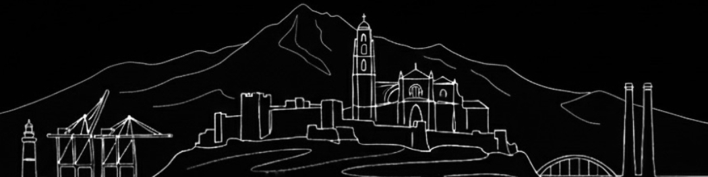

<picture>
  
</picture>

I design content and build interfaces, sometimes both on the same project.

## What I Do

**Content Design:** Structuring information for clarity, usability, and reduced cognitive load. I focus on user-facing copy, documentation, and process content where precision matters.

**Web Development:** HTML, CSS, and JavaScript fundamentals. Mobile-first, WCAG 2.1 AA accessible, Lighthouse scores 89–98.

## Background

2009–2020: High-traffic gambling platforms, 20+ UK council websites, SME business sites. Legacy stack experience (AngularJS, jQuery, XML templating) plus modern vanilla approaches.

2024–present: Content design practice. Published case studies at [Content design portfolio](https://mrkteq.github.io/content-designer).
